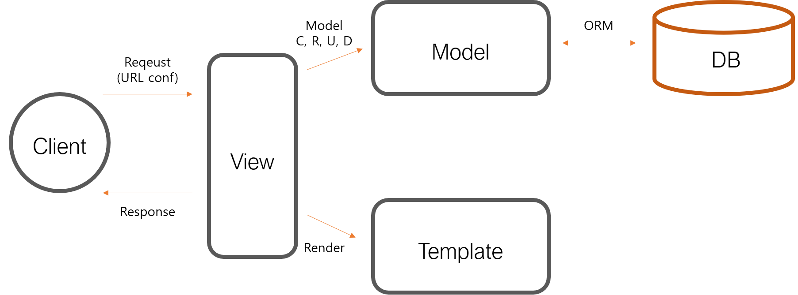

# Django MTV 패턴

## MTV(Model-Template-View) 패턴이란?

Django에서 사용하는 디자인 패턴으로, 각 구성요소가 다음과 같은 역할을 합니다:

### Model
- 데이터베이스 관련 로직 처리
- 데이터 구조와 형식 정의
- ORM을 통한 데이터베이스 상호작용

### Template  
- 사용자에게 보여지는 UI 부분
- HTML/CSS로 데이터 시각화
- Django 템플릿 언어(DTL) 사용

### View
- 컨트롤러 역할 수행
- Model과 Template 사이의 중개자
- 비즈니스 로직 처리

## 데이터 흐름

1. 사용자 요청 발생
2. View에서 요청 처리
3. Model을 통해 데이터 접근
4. Template으로 화면 구성
5. 사용자에게 결과 반환

이러한 MTV 패턴은 각 구성 요소의 역할을 명확히 분리하여 코드의 유지보수성과 재사용성을 향상시킵니다.